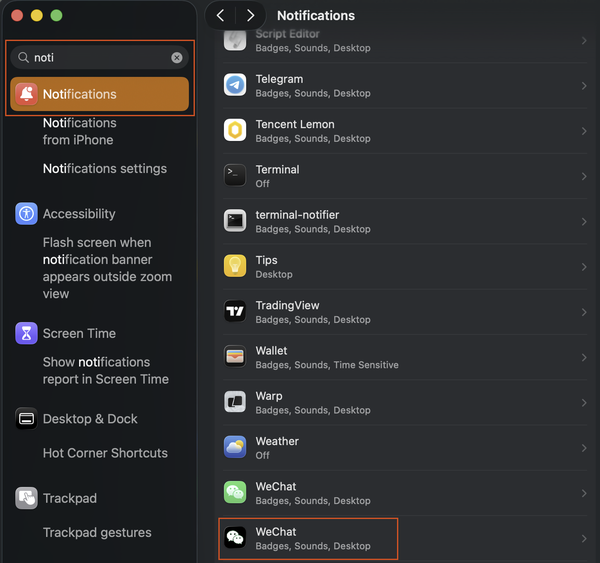

# 微信双开 · macOS 一键安装工具

macOS 微信双开/多开自动化安装与修复工具，内置 **6种主题配色图标**，每个微信实例一看便知。

## ⚠️ 重要：微信更新后需要修复

**这是什么问题？**

微信每次自动更新会覆盖 WeChat2.app 并把 Bundle ID 重置为与原版相同，导致**两者都无法启动**。这是正常现象，聊天记录不会丢失。

**解决方法超级简单 —— 直接说「修复微信多开」即可：**

```
修复微信多开
```

Agent 会自动检测并重建 WeChat2，保留聊天记录。

**建议：** 在「系统设置 → 通用 → 自动更新」中关闭微信自动更新，需要时手动修复。

---

## 6种内置图标

<p align="center">
   &nbsp;
   &nbsp;
   &nbsp;
   &nbsp;
   &nbsp;
  
</p>

| 配色 | 图标文件名 | 主题感 |
|------|-----------|--------|
| ⬛ 黑底 | `AppIcon-black.icns` | 低调、暗黑模式首选 |
| 🔵 青底 | `AppIcon-cyan.icns` | 清新、科技感 |
| 🟣 紫底 | `AppIcon-purple.icns` | 优雅、创意 |
| 🟠 橙底 | `AppIcon-orange.icns` | 活力、温暖 |
| 🔷 深蓝底 | `AppIcon-navy.icns` | 沉稳、商务 |
| ⬜ 深灰底 | `AppIcon-darkgray.icns` | 低调、简洁 |

**与原版对比：** WeChat.app = 🟢 绿底白标（原版）

---

## Quick Start

把下面这段 prompt **完整复制**给 AI Agent（Claude Code、Openclaw、Hermes 等）：

```
帮我安装 macOS 微信双开工具。

步骤：
1. 读取这个 Skill 的 SKILL.md 文件，路径在当前目录的 .agents/skills/wechat-multifix/SKILL.md
2. 按照 SKILL.md 中的流程执行安装

安装前，Agent 会自动询问你想要哪种配色（黑/青/紫/橙/深蓝/深灰），你只需要回复数字或配色名即可。

完成后告诉我：
- WeChat 和 WeChat2 的 Bundle ID 分别是什么？
- 两者是否不同？
```

Agent 会自动：
1. 读取 Skill 说明
2. **询问你想要哪种配色**
3. 执行完整安装流程（复制 → Bundle ID → 签名 → 换图标）
4. 验证 Bundle ID 唯一性
5. **提醒你关于微信更新后需要修复的事**

---

## 目录结构

```
wechat-multifix/
├── README.md              ← 本文件
├── SKILL.md               ← Agent 技能定义（自动安装+修复）
└── icons/
    ├── AppIcon-black.icns
    ├── AppIcon-cyan.icns
    ├── AppIcon-purple.icns
    ├── AppIcon-orange.icns
    ├── AppIcon-navy.icns
    ├── AppIcon-darkgray.icns
    └── previews/          ← 预览图
```

---

## 手动安装

```bash
SKILL_DIR="$HOME/.../wechat-multifix"
ICON="AppIcon-black.icns"  # 换成其他配色

cp -R /Applications/WeChat.app /Applications/WeChat2.app
/usr/libexec/PlistBuddy -c "Set :CFBundleIdentifier com.tencent.xinWeChat2" /Applications/WeChat2.app/Contents/Info.plist
/usr/libexec/PlistBuddy -c "Set :CFBundleName WeChat2" /Applications/WeChat2.app/Contents/Info.plist
xattr -cr /Applications/WeChat2.app
codesign --force --deep --sign - /Applications/WeChat2.app
chown -R $(whoami):admin /Applications/WeChat2.app
cp "$SKILL_DIR/icons/$ICON" /Applications/WeChat2.app/Contents/Resources/AppIcon.icns
codesign --force --deep --sign - /Applications/WeChat2.app
open -a /Applications/WeChat2.app
```

---

## 修复微信多开（打不开时用）

**触发词：「修复微信多开」**

当微信更新后 WeChat2 打不开了，直接说：

```
修复微信多开
```

Agent 会自动检测 Bundle ID 冲突，重建 WeChat2 并恢复图标，保留聊天记录。

---

## 🔔 通知权限（手动开启）

WeChat2 安装后需要手动开启通知权限，否则 Dock 没有红点提示、也没有弹窗通知。

**第一步：在 WeChat2 内部开启**

进入 WeChat2 → 设置 → 通知，确保以下开关全部打开：



- 新消息通知 → **开启**
- 新消息通知声音 → **开启**
- 显示消息预览 → **开启**

**第二步：在 macOS 系统设置中授权**

打开「系统设置 → 通知」，在列表中找到 **WeChat2**（不是原版 WeChat），确保允许通知。

> 注意：WeChat2 初次启动时 macOS 可能不会弹出授权提示，需要手动来这里开启。

---

## 技术原理

- **Bundle ID**：每个 macOS 应用唯一标识，直接复制会导致冲突
- **解决方法**：修改克隆版的 Bundle ID + 重新签名
- **数据存储**：`~/Library/Containers/com.tencent.xinWeChat2/`（与应用分离，修复不丢数据）

---

## License

MIT
